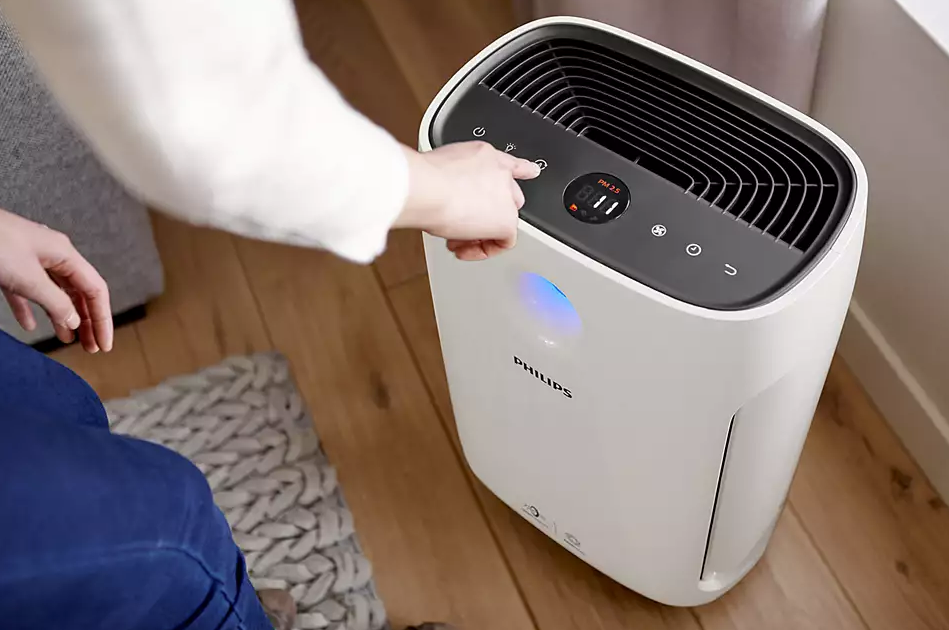

===============================
Philips Air Purifier Controller
===============================

:Author: marcinooo
:Tags: philips air purifier, python, client, api

:abstract: 

   A simple client to control the Philips AC2889 air purifier.

.. contents ::

Description
===========

The package is a simple interface for controlling the Philips AC2889 air purifier. It allows read parameters and set parameters.

Philips AC2889:

|

Installation
============

Install the package with pip:

`pip install git+https://github.com/martinwac/air_purifier.git`

|

Usage
=====

Simple example:

.. code:: python

   from philips_air_purifier import PhilipsAirPurifier

   HOST = '192.168.1.21'

   philips_air_purifier = PhilipsAirPurifier(host=HOST).connect()
   data = philips_air_purifier.get()
   print('Your air conditions:\n', data, '\n')

   print('Power on device...')
   philips_air_purifier.set(pwr='1')

   print('Increase device speed...')
   philips_air_purifier.set(mode='M', om='2')

List of all allowed parameters you can find in dictionary: 

.. code:: python

   import pprint
   from philips_air_purifier import ALLOWED_PARAMETERS_TO_SET

   pprint.pprint(ALLOWED_PARAMETERS_TO_SET)

.. warning::
   Some parameters must be set together:

   - setting speed in manual mode: ``philips_air_purifier.set(mode='M', om='2')``

   - setting manual with speed: ``philips_air_purifier.set(mode='M', om='s')``

|

License
=======

license_ (MIT)

.. _license: https://github.com/martinwac/air_purifier/blob/master/LICENSE.txt
